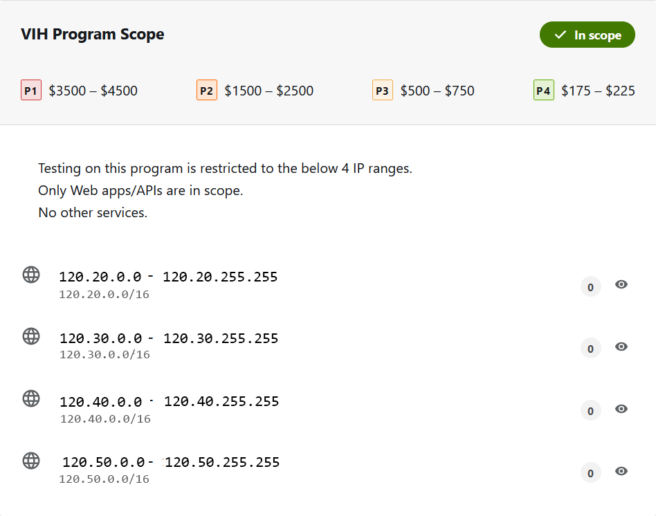

# IPGen Tool

The IP List Generator is a versatile bash script designed to generate a list of IP addresses within a specified range. Developed by **@AGNIHACKERS1**, this script allows you to customize the start and end IP addresses, choose an output file, and even add "**http://**" and "**https://**" prefixes if desired.

<h1 align="center">
  
  <br>
</h1>

## Features:

<ul><li>Generate a list of IP addresses within a specified range.</li>
<li>Customize the start and end IP addresses using command-line options.</li>
<li>Optionally add "http://" and "https://" prefixes to each IP address.</li>
<li>Choose an output file to save the generated IP list.</li></ul>

## Example Usage:

```./IPGen.sh [-r] [-h] [-s start_ip] [-e end_ip] [-o output_file]```

## Options:

```
Options:
   -r                Add http:// and https:// prefixes
   -h --help         Display this help message
  --s start_ip       Set the start IP address (default: 192.100.0.0)
  --e end_ip         Set the end IP address (default: 192.100.255.255)
  --o output_file    Set the output file (default: output.txt)
```
                           
### Generate IP lists effortlessly with this flexible and user-friendly tool.

## Installation:

```
git https://github.com/agnihackers/IPGen.git
chmod +x IPGen.sh
./IPGen.sh -h
```

## Support:

<li><b>Developer: <a href="https://twitter.com/AGNIHACKERS1">@AGNIHACKERS1</a></b></li>
<li><b>Personal Website:</b> https://www.zhackx.com/</li>
